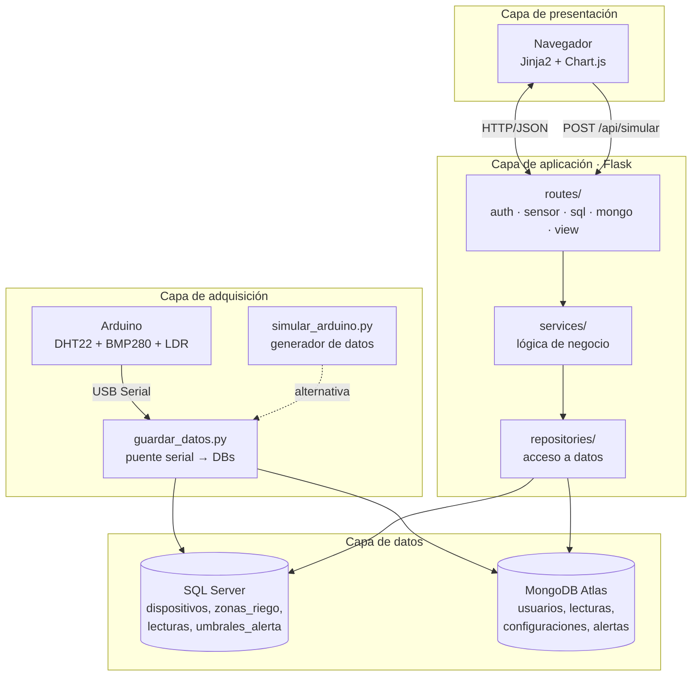
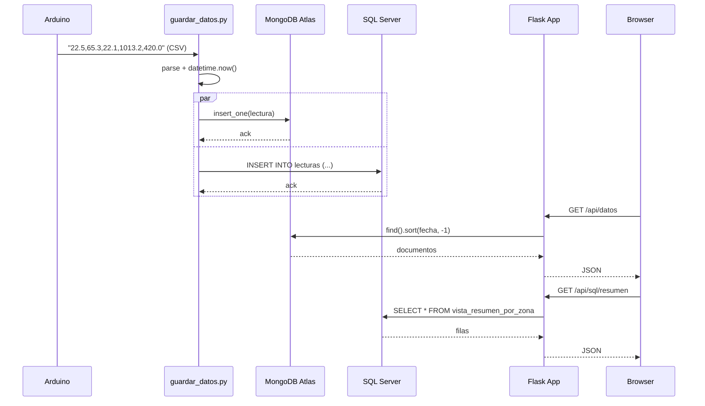
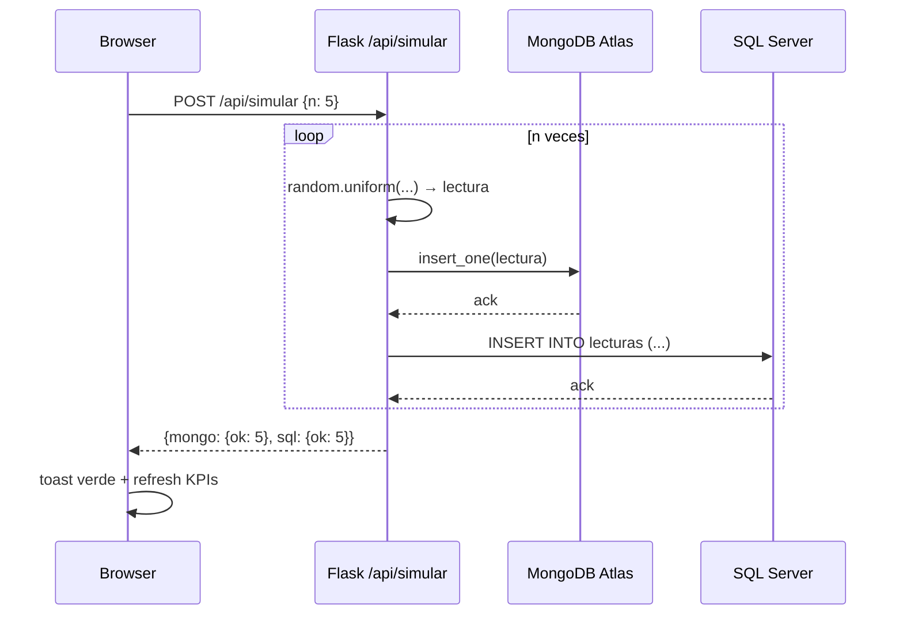
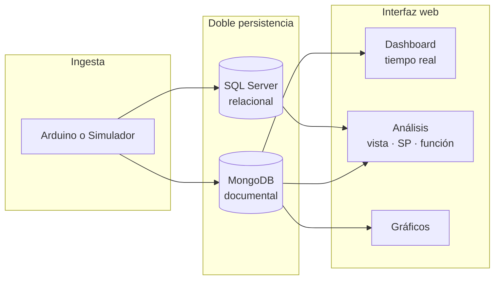

# Arquitectura del Sistema

Sistema IoT de monitoreo de sensores agrícolas con doble persistencia (SQL Server + MongoDB Atlas) y aplicación web Flask.

---

## 1. Visión general por capas



---

## 2. Flujo de una lectura



---

## 3. Flujo del simulador (sin Arduino)



---

## 4. Estructura de carpetas con responsabilidades

```
SensoresWeb_MongoDB/
├── app.py              ◄── Entry point: crea Flask, registra blueprints
├── config.py           ◄── Lee .env y expone Config
│
├── routes/             ── CAPA HTTP (recibe request → llama service)
│   ├── auth_routes.py     /login /registro /logout
│   ├── view_routes.py     /dashboard /analisis /graficos
│   ├── sensor_routes.py   /api/datos /api/simular
│   ├── sql_routes.py      /api/sql/*
│   └── mongo_routes.py    /api/mongo/*
│
├── services/           ── CAPA DE NEGOCIO (orquesta repositories)
│   ├── auth_service.py    hashing bcrypt, validaciones
│   ├── sensor_service.py  delega a sensor_repository
│   ├── serial_service.py  (futuro) ingesta serial encapsulada
│   └── sql_service.py     orquesta sql_repository
│
├── repositories/       ── CAPA DE ACCESO A DATOS
│   ├── sensor_repository.py      MongoDB: lecturas
│   ├── user_repository.py        MongoDB: usuarios
│   ├── sql_repository.py         SQL Server: vista, SP, función
│   └── mongo_extra_repository.py MongoDB: alertas, configuraciones
│
├── utils/              ── INFRAESTRUCTURA
│   ├── db.py              cliente MongoDB
│   ├── sql_server.py      conexión pyodbc a SQL Server
│   └── decorators.py      @login_required
│
├── templates/          ── VISTAS (Jinja2)
└── static/             ── CSS, JS, assets
```

---

## 5. Patrón Repository

Cada motor de base de datos tiene su propio repositorio. Las rutas **nunca** acceden directamente a las bases de datos — pasan por servicios, que delegan en repositorios.

| Capa | Sabe sobre HTTP | Sabe sobre lógica de negocio | Sabe sobre la BD |
|------|:--:|:--:|:--:|
| `routes/`       | ✅ | ❌ | ❌ |
| `services/`     | ❌ | ✅ | ❌ |
| `repositories/` | ❌ | ❌ | ✅ |

**Ventaja:** si mañana se cambia MongoDB por PostgreSQL para una colección, solo se reescribe el repositorio correspondiente — ni el servicio ni la ruta se enteran.

---

## 6. Estrategia de doble persistencia

**¿Por qué guardar la misma lectura en dos bases?**

| Aspecto | SQL Server | MongoDB |
|---------|-----------|---------|
| Rol de la lectura | Fuente de verdad relacional (con FK a `dispositivos`/`zonas_riego`) | Buffer crudo de ingesta |
| Garantía | Integridad referencial estricta | Disponibilidad inmediata aunque SQL esté caído |
| Consumo | Análisis: vistas, GROUP BY, JOINs | Streaming en vivo al dashboard |

**El `/api/simular`** ejecuta exactamente el mismo flujo que el Arduino real (parse → MongoDB → SQL Server) pero con datos generados, lo que permite validar todo el sistema sin hardware.

---

## 7. Resumen visual



Para más detalle del modelo de datos ver [`bases_de_datos.md`](bases_de_datos.md).
