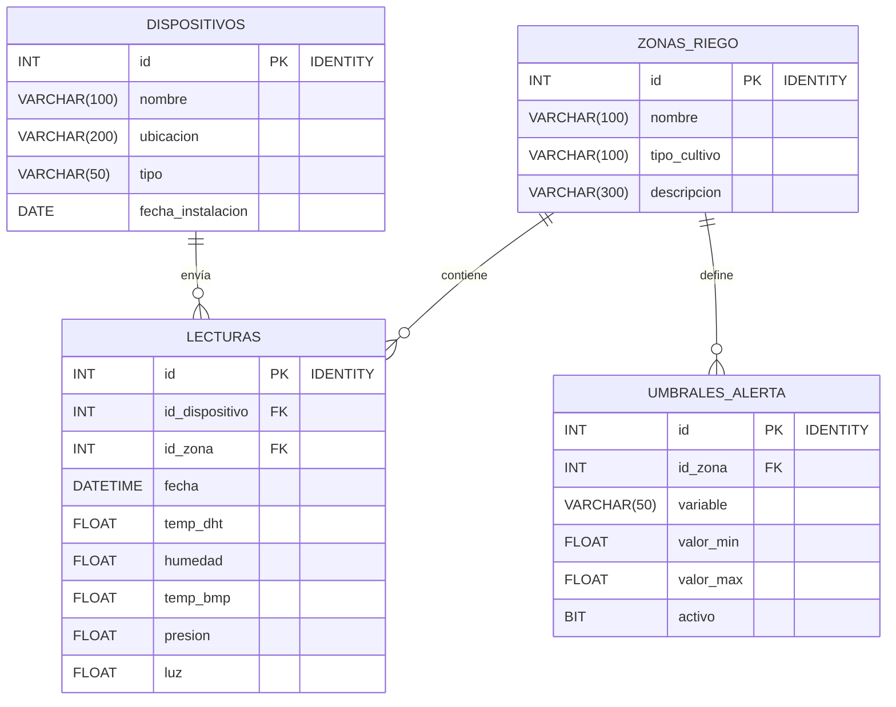
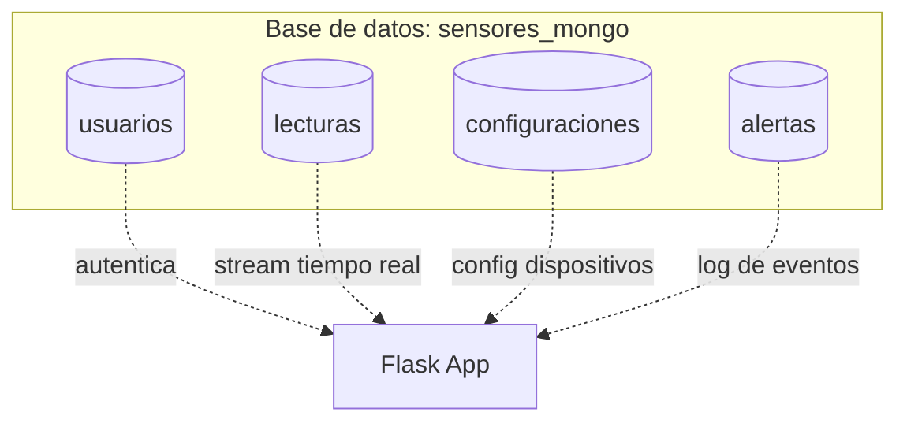
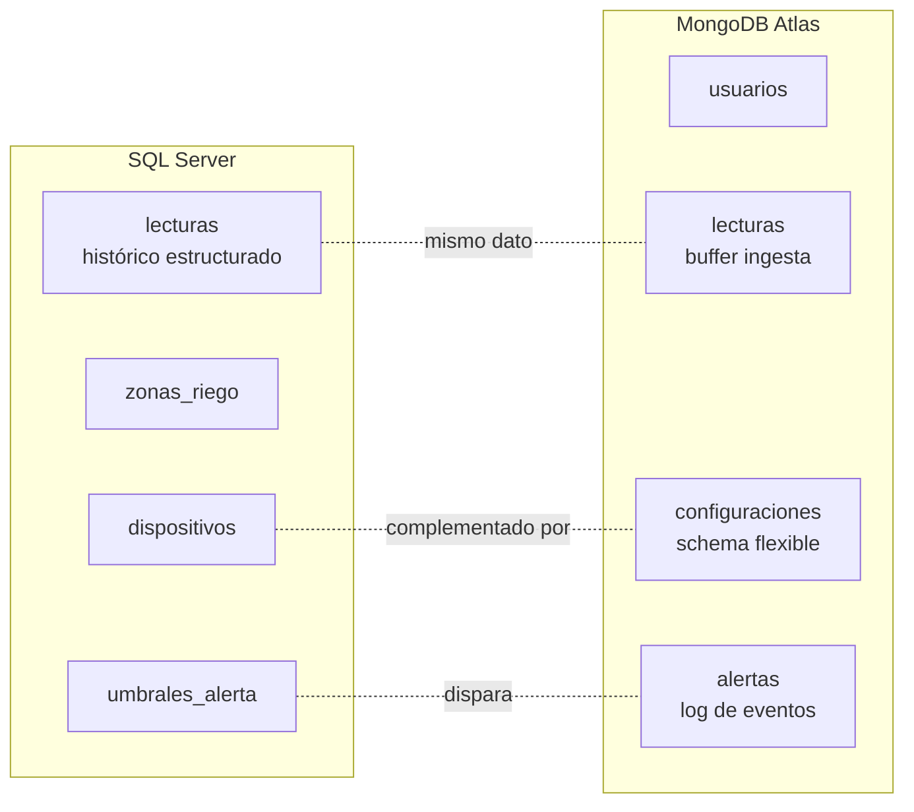

# Diseño de Bases de Datos

El sistema usa **dos motores complementarios**: SQL Server para el modelo relacional analítico y MongoDB Atlas para datos flexibles y de ingesta.

---

## 1. SQL Server — Modelo Relacional

### 1.1 Diagrama Entidad-Relación (ERD)



### 1.2 Tabla por tabla

#### `dispositivos`
Maestro de Arduinos instalados en campo. Una fila por dispositivo físico.

| Columna | Tipo | Restricción | Descripción |
|---------|------|-------------|-------------|
| `id` | INT | PK, IDENTITY(1,1) | Autonumérico |
| `nombre` | VARCHAR(100) | NOT NULL | "Arduino-01" |
| `ubicacion` | VARCHAR(200) | — | "Invernadero Norte" |
| `tipo` | VARCHAR(50) | — | "DHT22/BMP280/LDR" |
| `fecha_instalacion` | DATE | — | Cuándo se instaló |

#### `zonas_riego`
Áreas físicas de cultivo. Una zona puede tener varios dispositivos.

| Columna | Tipo | Restricción | Descripción |
|---------|------|-------------|-------------|
| `id` | INT | PK, IDENTITY(1,1) | Autonumérico |
| `nombre` | VARCHAR(100) | NOT NULL | "Zona A" |
| `tipo_cultivo` | VARCHAR(100) | — | "Tomate", "Lechuga"... |
| `descripcion` | VARCHAR(300) | — | Texto libre |

#### `lecturas` — tabla central de hechos
Cada inserción del Arduino (o del simulador) crea una fila aquí.

| Columna | Tipo | Restricción | Descripción |
|---------|------|-------------|-------------|
| `id` | INT | PK, IDENTITY(1,1) | Autonumérico |
| `id_dispositivo` | INT | FK → dispositivos(id), NOT NULL | Quién envió |
| `id_zona` | INT | FK → zonas_riego(id), NOT NULL | Dónde se midió |
| `fecha` | DATETIME | NOT NULL | Marca temporal |
| `temp_dht` | FLOAT | — | Temperatura sensor DHT22 (°C) |
| `humedad` | FLOAT | — | Humedad relativa (%) |
| `temp_bmp` | FLOAT | — | Temperatura sensor BMP280 (°C) |
| `presion` | FLOAT | — | Presión atmosférica (hPa) |
| `luz` | FLOAT | — | Luminosidad (lux) |

#### `umbrales_alerta`
Umbrales por zona y variable. Permite múltiples reglas por zona.

| Columna | Tipo | Restricción | Descripción |
|---------|------|-------------|-------------|
| `id` | INT | PK, IDENTITY(1,1) | Autonumérico |
| `id_zona` | INT | FK → zonas_riego(id), NOT NULL | Zona aplicada |
| `variable` | VARCHAR(50) | NOT NULL | "humedad", "temp_dht"... |
| `valor_min` | FLOAT | — | Límite inferior |
| `valor_max` | FLOAT | — | Límite superior |
| `activo` | BIT | NOT NULL DEFAULT 1 | Si la regla está en vigor |

---

### 1.3 Objetos avanzados

#### Vista: `vista_resumen_por_zona`

Pre-calcula promedios por zona y dispositivo combinando 3 tablas.

```sql
CREATE VIEW dbo.vista_resumen_por_zona AS
SELECT
    z.nombre        AS zona,
    d.nombre        AS dispositivo,
    COUNT(l.id)     AS total_lecturas,
    AVG(l.temp_dht) AS prom_temp,
    AVG(l.humedad)  AS prom_humedad,
    AVG(l.presion)  AS prom_presion,
    AVG(l.luz)      AS prom_luz
FROM lecturas l
INNER JOIN zonas_riego  z ON l.id_zona        = z.id
INNER JOIN dispositivos d ON l.id_dispositivo = d.id
GROUP BY z.nombre, d.nombre;
```

**Consumo desde Flask** → `GET /api/sql/resumen`

#### Función escalar: `fn_clasificar_humedad`

Recibe un valor numérico y devuelve la categoría textual.

```sql
CREATE FUNCTION dbo.fn_clasificar_humedad (@humedad FLOAT)
RETURNS VARCHAR(20)
AS BEGIN
    DECLARE @r VARCHAR(20);
    IF @humedad < 40       SET @r = 'SECA';
    ELSE IF @humedad <= 70 SET @r = 'OPTIMA';
    ELSE                   SET @r = 'EXCESO';
    RETURN @r;
END;
```

**Consumo desde Flask** → `GET /api/sql/humedad/<valor>`

#### Procedimiento almacenado: `sp_lecturas_por_zona`

Retorna las 10 lecturas más recientes de una zona específica.

```sql
CREATE PROCEDURE dbo.sp_lecturas_por_zona @id_zona INT
AS BEGIN
    SET NOCOUNT ON;
    SELECT TOP 10
        l.id, z.nombre AS zona, d.nombre AS dispositivo,
        l.fecha, l.temp_dht, l.humedad, l.temp_bmp, l.presion, l.luz
    FROM lecturas l
    INNER JOIN zonas_riego  z ON l.id_zona        = z.id
    INNER JOIN dispositivos d ON l.id_dispositivo = d.id
    WHERE l.id_zona = @id_zona
    ORDER BY l.fecha DESC;
END;
```

**Consumo desde Flask** → `GET /api/sql/zona/<id>`

---

## 2. MongoDB Atlas — Modelo Documental

### 2.1 Colecciones



### 2.2 Esquema de cada colección

#### `usuarios`
Autenticación de la aplicación web. Esquema flexible — campos opcionales pueden agregarse sin migración.

```json
{
  "_id": ObjectId("..."),
  "nombre": "Juan Pérez",
  "correo": "juan@ejemplo.com",
  "password_hash": "$2b$12$...",
  "fecha_creacion": ISODate("2026-05-22T10:00:00Z")
}
```

#### `lecturas`
Buffer de ingesta en tiempo real. Cada fila también va a SQL Server.

```json
{
  "_id": ObjectId("..."),
  "fecha": ISODate("2026-05-22T14:30:00Z"),
  "temp_dht": 24.5,
  "humedad": 62.3,
  "temp_bmp": 24.2,
  "presion": 1013.5,
  "luz": 750.0
}
```

#### `configuraciones`
Una por dispositivo. Estructura anidada que el modelo relacional no puede expresar limpiamente.

```json
{
  "_id": ObjectId("..."),
  "id_dispositivo": 1,
  "nombre": "Arduino Norte",
  "horario_riego": {
    "inicio": "06:00",
    "fin": "07:30",
    "dias": ["lunes", "miercoles", "viernes"]
  },
  "alertas_activas": ["humedad", "temp_dht"],
  "umbral_bateria": 20,
  "metadata": {
    "firmware": "v2.1",
    "ultima_calibracion": "2024-11-15"
  }
}
```

#### `alertas`
Log de eventos con estructura variable y contexto rico.

```json
{
  "_id": ObjectId("..."),
  "fecha": ISODate("2026-05-22T13:00:00Z"),
  "id_zona": 1,
  "zona": "Zona A Tomate",
  "variable": "humedad",
  "valor_medido": 18.5,
  "umbral_superado": 30.0,
  "nivel": "critico",
  "mensaje": "Humedad muy por debajo del mínimo crítico"
}
```

---

## 3. Cómo se complementan los dos motores



| Aspecto | SQL Server | MongoDB |
|---------|-----------|---------|
| **Fortaleza** | Integridad referencial, JOINs, GROUP BY | Esquema flexible, ingesta rápida, documentos anidados |
| **Uso en este proyecto** | Análisis histórico y consultas cruzadas | Configuraciones evolutivas, buffer y log de eventos |
| **Modelo** | Relacional normalizado | Documental desnormalizado |
| **Migraciones** | `ALTER TABLE` | No requeridas (schema-less) |

---

## 4. Reglas de integridad

### SQL Server (declarativas)

- `lecturas.id_dispositivo` debe existir en `dispositivos.id` (FK)
- `lecturas.id_zona` debe existir en `zonas_riego.id` (FK)
- `umbrales_alerta.id_zona` debe existir en `zonas_riego.id` (FK)
- `lecturas.fecha` no puede ser NULL

### MongoDB (aplicacionales)

- `usuarios.correo` único — validado por la app antes de insertar
- `configuraciones.id_dispositivo` debería existir en SQL — validado por la app
- `alertas.nivel` ∈ `{normal, advertencia, critico}` — convención del proyecto

---

## 5. Script de creación / poblamiento

| Recurso | Script | Comando |
|---------|--------|---------|
| Schema + datos SQL Server | `schema_sensores.sql` | Abrir en SSMS y ejecutar (F5) |
| Datos MongoDB | `poblar_mongo.py` | `python poblar_mongo.py` |
| Lecturas de prueba en **ambas** | `simular_arduino.py` | `python simular_arduino.py` |
| Lecturas desde el dashboard | botón "Simular Arduino" | UI web |
